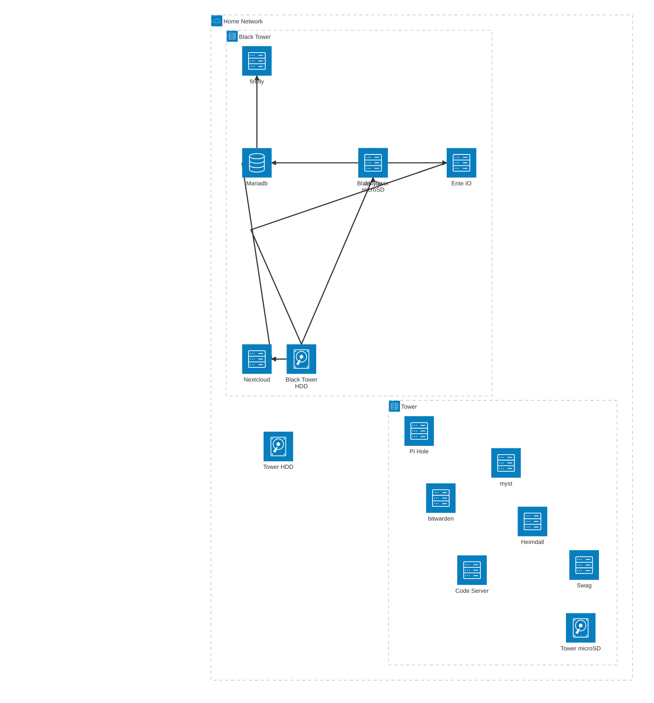

# home-server-setup

## Getting started

### ENV file

Add the proper `HOME_SERVER_BASE_DOMAIN` value(your base domain to host the server).

### Start the server

```shell
# On tower server
❯ docker compose --profile tower --env-file .env up -d

# On black-tower server
❯ docker compose --profile black-tower --env-file .env up -d
```

### Stop the server

```shell
# On tower server
❯ docker compose --profile tower down --remove-orphans

# On black-tower server
❯ docker compose --profile black-tower down --remove-orphans
```

## Servers

- tower
- black-tower

### Services in `tower` server

- Deployed:
  - swag
  - heimdall
  - code-server
  - myst
- ToDo:
  - firefly
  - bitwarden
  - pi-hole

### Services in `black-tower` server

- Deployed:
  - mariadb
  - nextcloud
  - jellyfin
- ToDo:
  - ente.io

## Volumes used by the Services

| Name               | Type | Service     | Local path (if any)    | Read Only | Description                  |
| ------------------ | ---- | ----------- | ---------------------- | --------- | ---------------------------- |
| Heimdall (config)  | Bind | heimdall    | `./heimdall/config`    | No        | Heimdall config path         |
| Myst (data)        | Bind | myst        | `./myst/data`          | No        | Myst data path               |
| MariaDB            | Bind | mariadb     | `./mariadb/config`     | No        | MariaDB data/config path     |
| Nextcloud (config) | Bind | nextcloud   | `./nextcloud/config`   | No        | Nextcloud config path        |
| Nextcloud (data)   | Bind | nextcloud   | `./nextcloud/data`     | No        | Nextcloud data path          |
| Code Server        | Bind | code-server | `./code-server/config` | No        | Code Server config/data path |
| Swag               | Bind | swag        | `./swag/config`        | No        | Swag config/data path        |

## Architecture


