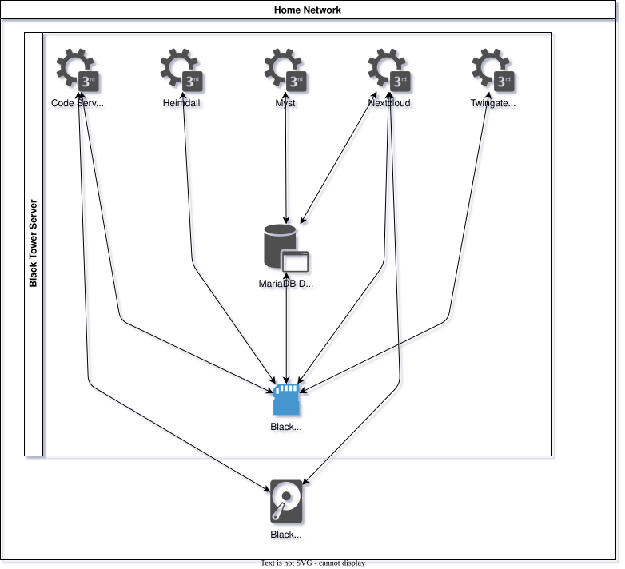

# home-server-setup

## Getting started

### Setting up the environment (`.env` file)

Copy the `example.env` as `.env` file.

```shell
❯ cp example.env .env
```

Modify the proper `HOME_SERVER_BASE_DOMAIN` value(your base domain to host the server).

### Start the services

```shell
# On black-tower server
❯ docker compose --profile black-tower --env-file .env up -d

# On tower-ii server
❯ docker compose --profile tower-ii --env-file .env up -d
```

### Stop the services

```shell
# On black-tower server
❯ docker compose --profile black-tower down --remove-orphans

# On tower-ii server
❯ docker compose --profile tower-ii down --remove-orphans
```

## Servers

- black-tower
- tower-ii

### Services in `black-tower` server

- Deployed:
  - code-server
  - heimdall
  - mariadb
  - myst
  - nextcloud
  - twingate-connector
- Planned:
  - ente.io

### Services in `tower-ii` server

- Deployed:
  - twingate-connector
- Planned:
  - firefly-iii
  - bitwarden
  - pi-hole

## Architecture


